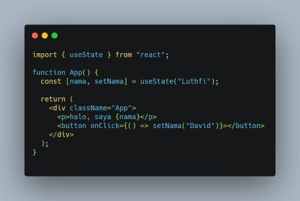
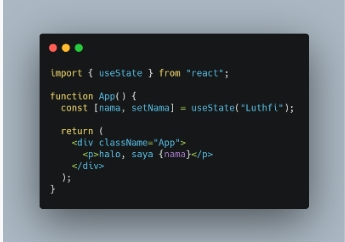
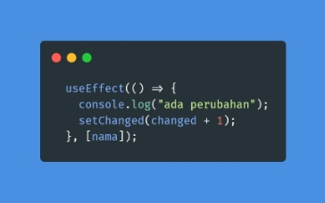

# React Js Hooks

## Apa Itu Hooks
Hooks merupakan fitur baru di React 16.8. Fitur ini memungkinkan kita menggunakan state dan fitur React lainnya tanpa menuliskan sebuah kelas. 
<br>

### Kelebihan Penggunaan Hooks

Dengan menggunakan functional component dan menggunakan Hooks, maka kode akan terlihat lebih clean, pendek, dan mudah dimengerti.

### useStates?

Cara menggunakannya :

1. Import useStates dari reaxct

``` import {useStates} from "react"; ```

2. Menulis useStates hooks

``` const [nama, setNama] = useStates("luthfi") ```

3.Memanggil data 

``` <p> Hallo, saya {nama} </p>```

4.Mengupdate state

``` <button onClick={ setNama("david")> }> ubah </button>```

Full Code



Ada juga beberapa hooks tapi jarang digunakan :

- useContext
- useReducer

# Reminder

Menggunakan hooks harus selalu dipanggil di bagian atas component. Biasanya setelah pembuatan function component sama halnya dengan useStates dan useEffect



Gunakan [ ] di akhiran useEffect agar tidak terjadi re-render yang berlebihan



# React-Router

React Router adalah sistem perpustakaan standar yang dibangun di atas React dan digunakan untuk membuat perutean di aplikasi React menggunakan Paket React Router.

## Basic Installation

``` $ npm install react-router-dom@6 ```

Create React App dengan cara import 

```import { BrowserRouter } from "react-router-dom";```

kemudian kita bisa menggunakan React Router dimanapun di dala aplikasi yang kita kerjakan
# Menggunakan Tag Skrip HTML

```Salah satu cara tercepat untuk menambahkan React dan React Router ke situs web adalah dengan menggunakan <script>tag lama dan variabel global. React Router kompatibel dengan React 16.8+. Cukup tambahkan <script>tag berikut ke HTML Anda, tepat sebelum </body>tag penutup```

Komponen di React Router

Ada dua jenis komponen router:

<BrowserRouter>: Ini digunakan untuk menangani URL dinamis.

<HashRouter>: Ini digunakan untuk menangani permintaan statis.

# React Redux

Redux adalah salah satu library state management yang biasa disandingkan dengan react.
sederhananya yaitu dengan menyimpan state di satu tempat, sehingga lebih mudah untuk di manage.

## Cara kerja Redux

Ada 4 faktor utama :

- UI

Ini adalah tampilan aplikasi

- Action

Adalah sebuah function yang mereturn sebuah objek.

Objek tersebut memiliki sebuah property wajib yaitu type.

Type inilah yang menentukan bagaimana statenya akan diubah.

- Reducer

Adalah sebuah fungsi yang tugasnya untuk mengolah state yang ada di store.

Misal menambah data, menghapus data, mengambil data, dsb.

Ada 2 parameter wajib dari reducer, yaitu state dan action.

- Store

Store adalah tempat untuk menampung state.

Jadi store ibarat database untuk frontend.

Alur kerjanya seperti berikut:

Pertama akan ada triger dari UI
Kemudian akan ke action
Dari action reducer akan mengubah state yang sesuai dengan type dari action tadi
Terahir update UI lagi
